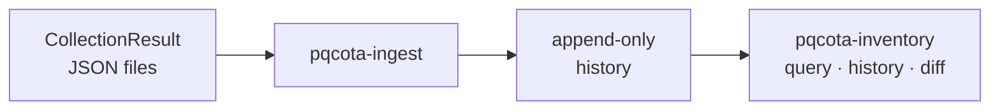

[English](README.md) · 한국어

# pqcota-inventory: 중앙 인벤토리 (2단계)

관측(Discovery)이 만든 관측 결과를 **받아서 저장하고 제공합니다.** 반복 수집한 결과를 자산 이력으로 쌓고, 시스템 메타데이터(엔드포인트, 프로필)와 **앱 귀속**을 붙여서 "무엇이 어떤 암호 알고리즘을 어디서 쓰는가"를 조회할 수 있는 인벤토리로 만듭니다.

[pqcota](https://github.com/randyinthedev-hash/pqcota)를 이루는 다섯 리포지터리 중 하나입니다. 나머지는 `pqcota-common`, `pqcota-discovery`, `pqcota-provisioning`, 그리고 통합 리포지터리 `pqcota`(데모, 예제, 릴리스 묶음, 기여 안내)입니다.

## 한눈에 보기



## 구성

| 구성 요소 | 하는 일 |
|---|---|
| **적재** (`pqcota-ingest`) | 가져온 결과를 정규화해 이력에 추가합니다. 쓰기 경로는 이것 하나뿐입니다 |
| **이력** | 변경 시점마다 남기는 스냅샷입니다. 추가만 가능하므로 이전 관측을 덮어쓰지 않습니다 |
| **시스템 메타데이터** | 엔드포인트와 프로필(환경, 역할, 소유자)입니다. **접속 비밀 정보는 저장하지 않습니다** |
| **조회** (`pqcota-inventory`) | 최신 상태, 이력, 스냅샷 사이의 차이를 보여 줍니다. 읽기 전용입니다 |

**자산은 시스템 → 앱 → 프로세스의 세 층입니다.** 앱은 `(node_id, app_key)`로 유일하게 식별하고, 프로세스는 휘발성이라 저장하지 않고 필요할 때 그때그때 확인합니다.

## 빠르게 해 보기

```bash
# ① ingest — read a directory of retrieved results
export PQCOTA_DSN='postgres://user:pw@host:5432/pqcota'
pqcota-ingest ./results

# ② query — latest state across all nodes
pqcota-inventory

# ③ history and change
pqcota-inventory -history node-01
pqcota-inventory -diff <older-id>,<newer-id>
```

외부 도구가 만든 CBOM이나 CMDB 선언도 같은 이력에 들어갑니다.

```bash
pqcota-cbom-ingest cbom.json cmdb://payment-gw     # a CBOM scanned by an external tool
pqcota-declare cmdb.csv --out ./declared && pqcota-ingest ./declared   # a CMDB declaration
```

데이터 저장소 없이 파일만 대조하려면 `pqcota-discover-view ./results`를 쓰세요. 명령별 인자는 [cmd/README](cmd/README.ko.md)에 있습니다.

**여러 조직이 하나의 데이터 저장소를 쓴다면** 모든 명령이 조직을 `PQCOTA_ORG`에서 받습니다. 지정하지 않으면 저장소는 `default`에 묶이고, `PQCOTA_REQUIRE_ORG=1`이면 조직 없이는 저장소를 열지 않습니다. 조직마다 자기 `node_id` 공간을 가지므로 `web-01`이 둘이어도 서로 덮어쓰지 않습니다.

```bash
export PQCOTA_ORG=acme PQCOTA_REQUIRE_ORG=1 PQCOTA_REQUIRE_SIGNATURE=1
```

세 가지 모두 경고 없이 통과해 버릴 수 있는 경로를 막습니다. 조직 없이 여는 것, 서명을 확인할 수단이 없는데 결과를 받는 것, 없던 스키마를 새로 만들어 거기에 쓰는 것입니다. 자세한 내용은 [cmd/README](cmd/README.ko.md#pqcota-ingest)에 있습니다.

## 무엇이 들어오는가

**출처에 따라 명령이 다르고**, 함께 기록하는 탐지 방법도 다릅니다.

| 출처 | 명령 | 어떻게 보았나 → 증거 강도 |
|---|---|---|
| **[수집기](https://github.com/randyinthedev-hash/pqcota-discovery/blob/main/README.ko.md)가 직접 관측** | `pqcota-ingest` | **실행 중인 프로세스를 직접 관측했습니다**(`runtime_introspection`) → `confirmed`<br>JVM attach가 막혀 파일만 읽었다면 `artifact` → `inferred_high` |
| **외부 도구가 스캔한 CBOM**(CBOMkit 등) | `pqcota-cbom-ingest` | **빌드 산출물을 읽었습니다**(`artifact`) → `inferred_high` |
| **아무도 스캔하지 않은 기록**(CMDB, 기존 인벤토리) | `pqcota-declare` → `pqcota-ingest` | **본 적 없음**: 비어 있음(`unspecified`) → 강도 없음 |

앞의 둘은 **누가 수집했든 실제로 관측한 것**이고 강도만 다릅니다. 실행 중인 프로세스를 보는 것이 빌드 산출물을 읽는 것보다 강합니다. 셋째는 관측이 전혀 없는 다른 레인입니다. 적어 둔 가정이 관측한 사실과 섞이면 "CMDB에는 그렇게 적혀 있지만 관측된 적은 없다"를 더는 구분할 수 없게 됩니다. 그 구분이 대조(reconcile)의 기준선입니다.

기록하는 것은 **어떻게 보았는가**(`detection_method`)뿐입니다. **강도(`evidence_strength`)는 저장하지 않고 그 값에서 매번 다시 계산합니다.** 도출 규칙이 개선되면 과거 결과도 같은 규칙으로 읽게 하려는 것입니다. 값의 전체 목록은 [계약](https://github.com/randyinthedev-hash/pqcota-common/blob/main/contracts/data-model.ko.md)에 있습니다.

## 들어 있는 것

| 경로 | 내용 |
|---|---|
| `pkg/inventory/` | 라이브러리: `history`(추가만 가능한 저장소, 메모리와 Postgres), `normalize`(원시 캡처에서 파생 발견 항목으로), `ingest`, `resultio`, `declaration`, 그리고 뷰 |
| `cmd/` | 명령: `pqcota-ingest`, `pqcota-inventory`, `pqcota-discover-view`, `pqcota-cbom-ingest`, `pqcota-declare`, `pqcota-declare-attribution`, `pqcota-profile`, `pqcota-prune` |
| `examples/` | 실행해 볼 수 있는 예제(`inventory/`: 뷰, 선언한 귀속, CBOM 수용)와, 관측 예제도 읽는 공유 샘플 결과 `examples/data/` |

## 의존하는 것

`pqcota-common`뿐입니다. 관측과 전환물 생성이 모두 이 모듈에 의존하므로, 이 모듈은 둘 중 어느 것도 가져오지 않습니다.

## 빌드와 테스트

```bash
make            # every check of this repository
go test ./...   # unit tests only
```

`go.mod`는 `replace` 지시자로 형제 리포지터리를 `../`에서 읽으므로(`../pqcota-common` 등) 리포지터리를 나란히 클론하세요. `replace` 줄은 그대로 둡니다. 리포지터리 사이의 로컬 연결이 그것이고, `require` 줄은 릴리스 태그(현재 `v0.10.4`)를 가리키며 이 작업 공간 밖의 사용자가 받는 쪽이 그것입니다. [빌드 안내](https://github.com/randyinthedev-hash/pqcota/blob/main/docs/build.ko.md#소스-받기)를 보세요.

## 함께 보기

뷰, 저장소, 선언 가져오기 라이브러리 [`pkg/inventory/`](pkg/inventory) · 실행해 볼 수 있는 예제 [`examples/inventory/`](examples/inventory)

## 기여 · 보안 · 라이선스

기여와 보안 신고 방법은 [pqcota 리포지터리](https://github.com/randyinthedev-hash/pqcota)에 있습니다.

Copyright 2026 Great Honor <randyinthedev@gmail.com>. 라이선스는 [Apache License 2.0](https://github.com/randyinthedev-hash/pqcota-inventory/blob/main/LICENSE)(영문)입니다.
